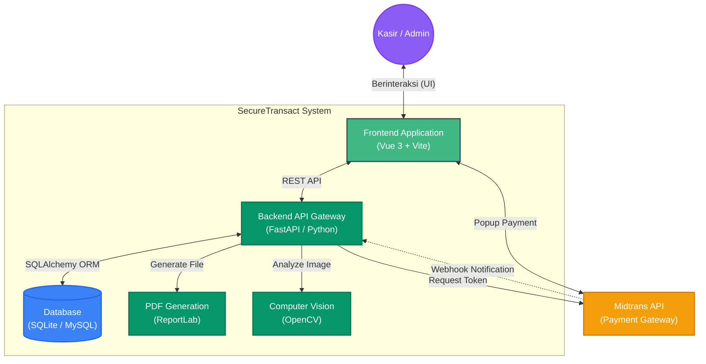
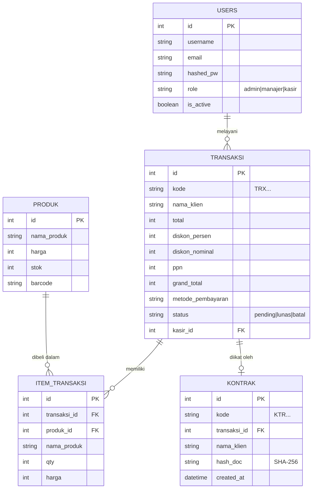
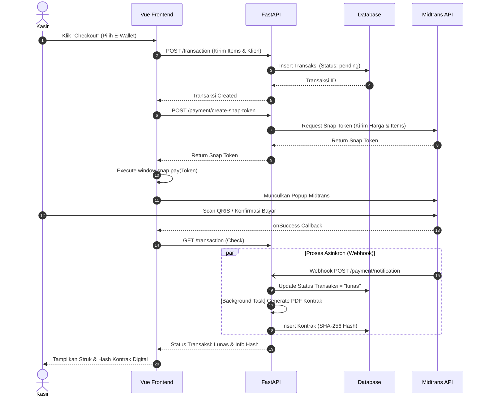

# Arsitektur Proyek SecureTransact

Dokumen ini menjelaskan struktur desain dan arsitektur dari aplikasi SecureTransact. Arsitektur didesain dengan konsep **Monolithic Terpisah** (Backend API dan Frontend Client berjalan secara independen) untuk mempermudah _scaling_ dan pemeliharaan.

---

## 1. High-Level Architecture (C4 Model - System Context)

Diagram ini menunjukkan gambaran besar bagaimana komponen sistem berinteraksi dengan dunia luar (User dan layanan pihak ketiga seperti Midtrans).

> **Alur Kerja Utama:** Frontend SPA berinteraksi dengan API FastAPI. API ini kemudian bertugas melakukan operasi ke Database, memanggil AI Vision untuk deteksi uang, membuat dokumen PDF (Kontrak), serta berkoordinasi dengan Midtrans untuk pembuatan Token Pembayaran.

---

## 2. Entity Relationship Diagram (ERD)

Struktur tabel relasional di dalam Database (SQLite/MySQL). Tabel didesain untuk mencatat siapa yang melakukan transaksi, item apa saja yang dibeli, dan kontrak digital mana yang terikat pada transaksi tersebut.

> Hubungan `TRANSAKSI` ke `KONTRAK` adalah *One-to-One* (Satu transaksi memiliki maksimal satu kontrak digital PDF yang di-hash).

---

## 3. Workflow Sequence: Transaksi & Payment Gateway

Proses krusial dari saat pengguna melakukan checkout di Frontend, menampilkan Midtrans, hingga dokumen kontrak selesai di-generate oleh sistem.

> Sistem sengaja mendesain *Pembuatan PDF Kontrak* sebagai **Background Task** (`BackgroundTasks` di FastAPI) agar API respon tidak melambat atau terblokir saat sistem sibuk me-render dokumen PDF.
