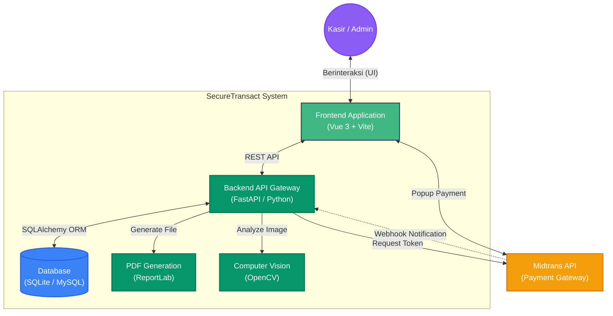
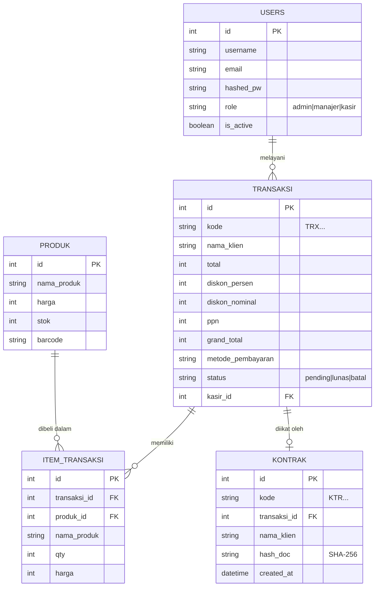
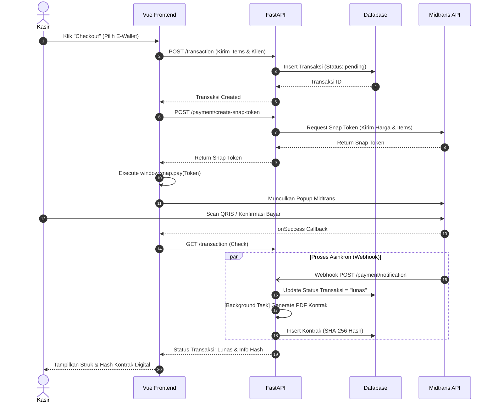
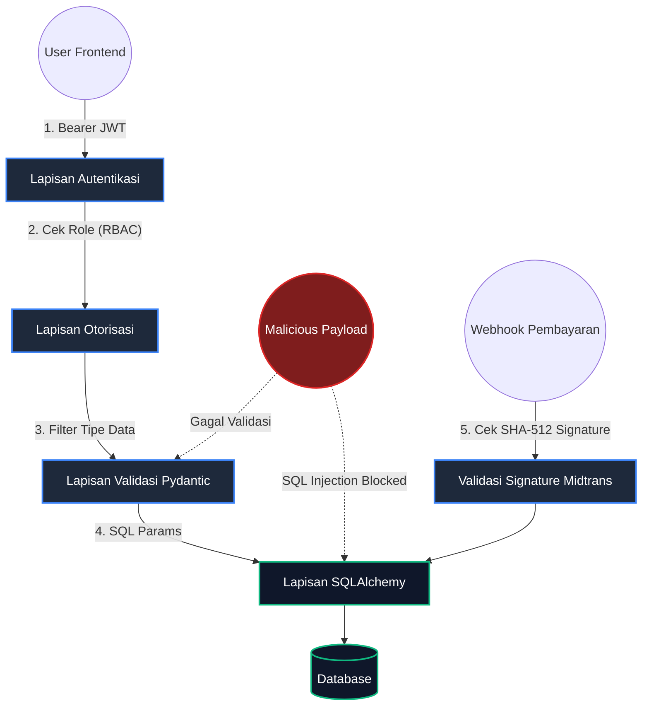

# Arsitektur Proyek SecureTransact

Dokumen ini menjelaskan struktur desain dan arsitektur dari aplikasi SecureTransact. Arsitektur didesain dengan konsep **Monolithic Terpisah** (Backend API dan Frontend Client berjalan secara independen) untuk mempermudah _scaling_ dan pemeliharaan.

---

## 1. High-Level Architecture (C4 Model - System Context)

Diagram ini menunjukkan gambaran besar bagaimana komponen sistem berinteraksi dengan dunia luar (User dan layanan pihak ketiga seperti Midtrans).

> **Alur Kerja Utama:** Frontend SPA berinteraksi dengan API FastAPI. API ini kemudian bertugas melakukan operasi ke Database, memanggil AI Vision untuk deteksi uang, membuat dokumen PDF (Kontrak), serta berkoordinasi dengan Midtrans untuk pembuatan Token Pembayaran.

---

## 2. Entity Relationship Diagram (ERD)

Struktur tabel relasional di dalam Database (SQLite/MySQL). Tabel didesain untuk mencatat siapa yang melakukan transaksi, item apa saja yang dibeli, dan kontrak digital mana yang terikat pada transaksi tersebut.

> Hubungan `TRANSAKSI` ke `KONTRAK` adalah *One-to-One* (Satu transaksi memiliki maksimal satu kontrak digital PDF yang di-hash).

---

## 3. Workflow Sequence: Transaksi & Payment Gateway

Proses krusial dari saat pengguna melakukan checkout di Frontend, menampilkan Midtrans, hingga dokumen kontrak selesai di-generate oleh sistem.

> Sistem sengaja mendesain *Pembuatan PDF Kontrak* sebagai **Background Task** (`BackgroundTasks` di FastAPI) agar API respon tidak melambat atau terblokir saat sistem sibuk me-render dokumen PDF.

---

## 4. Mengapa Arsitektur Ini Disebut "Secure by Design"?

Proyek ini dibangun dari awal dengan mengintegrasikan konsep keamanan di setiap lapisannya (Defense in Depth). Berikut adalah implementasi *Secure by Design* pada arsitektur di atas:

### A. Layered Security Model (Diagram)

### B. Prinsip Keamanan yang Diterapkan

1. **Pemisahan Logika (Separation of Concerns)**
   *Frontend* sama sekali tidak memiliki akses langsung ke *Database*. Akses hanya terjadi via REST API, yang mana mengurangi risiko jika *Frontend* disusupi.

2. **Validasi Input Ketat (Pydantic & FastAPI)**
   Semua data yang dikirim (*Payload JSON*) disaring dengan ketat secara tipe data dan strukturnya oleh `Pydantic`. Data yang aneh/berbahaya akan otomatis ditolak dengan kode `422 Unprocessable Entity` sebelum menyentuh logika bisnis. Ini menangkal ancaman seperti *SQL Injection* atau eksploitasi parameter.

3. **Autentikasi Stateless (JWT) & Enkripsi Kredensial**
   Password tidak pernah disimpan secara teks mentah (plaintext), melainkan di-hash menggunakan algoritma `Bcrypt` (library *Passlib*). Sesi dipertahankan menggunakan JWT yang tidak bisa dimanipulasi (*Tamper-proof*) karena memiliki signature dari server.

4. **Role-Based Access Control (RBAC)**
   Adanya aturan ketat: Kasir tidak bisa mendaftarkan user baru atau menghapus transaksi. Modul `/users` hanya bisa diakses oleh token dengan role `admin`. Hal ini menerapkan prinsip *Principle of Least Privilege*.

5. **Integritas Dokumen Kriptografi (SHA-256 Kontrak)**
   Sistem Kontrak Digital tidak hanya menghasilkan PDF, tetapi menciptakan jejak *Hash SHA-256* atas PDF tersebut ke database. Jika ada pihak yang memanipulasi file PDF di masa depan, Hash-nya tidak akan sama dengan yang dicatat oleh database. Ini memastikan hukum **Non-repudiation** (tidak bisa disangkal).

6. **Keamanan Eksternal (Webhook Anti-Spoofing)**
   Tidak sembarang orang bisa menebak *URL Webhook Midtrans* dan memalsukan pembayaran. Endpoint `/payment/notification` secara ketat memverifikasi `Signature Key` (menggunakan algoritma hashing `SHA-512` dengan menggabungkan ID Order, Harga, dan Server Key). Jika signature tidak cocok, request ditolak.
